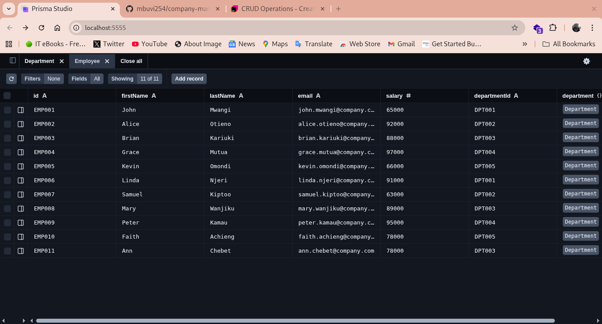
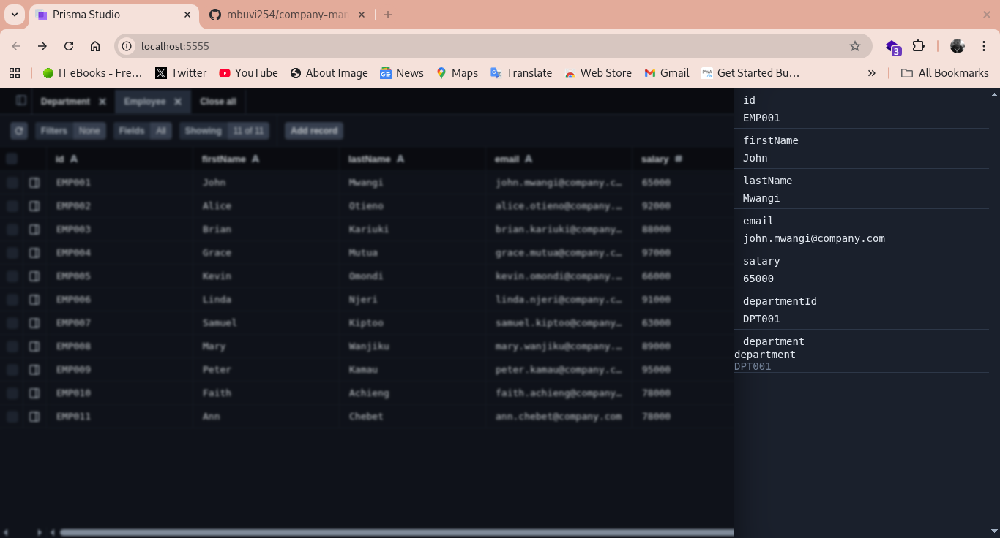
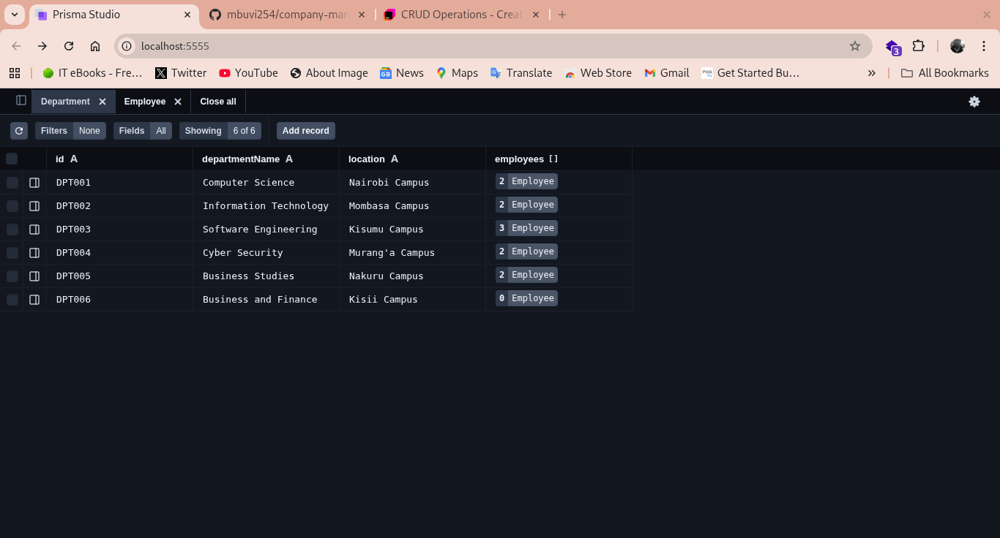
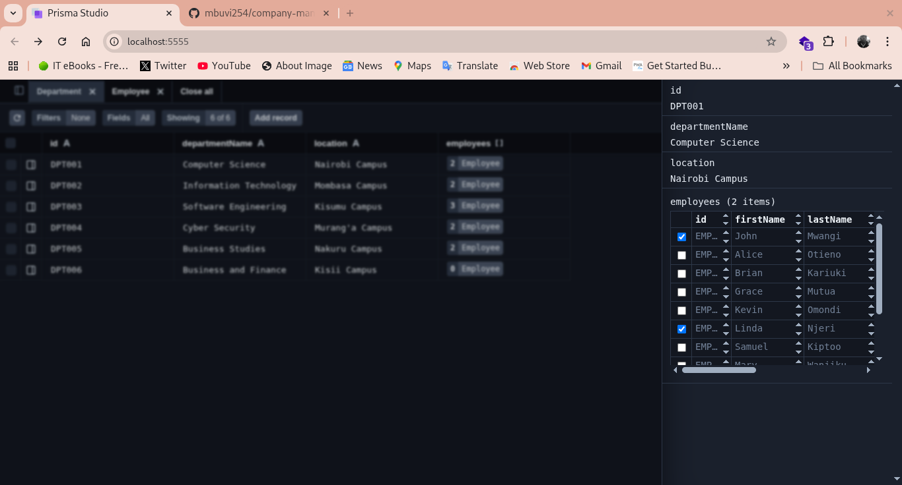

# Company Employee Management System

Node.js application for managing employees and departments using Prisma ORM with SQL Server.

## Screenshots

<p align="center">
  
  
</p>

<p align="center">
  
  
</p>


## Tech Stack
- Node.js
- Prisma ORM 
- MSSQL Server
- Javascript


## Setup

1. Install dependencies:
```bash
npm install
```

2. Configure `.env` file:
```env
DATABASE_URL="sqlserver://server:1433;database=db;user=user;password=pass"
```

3. Push database schema:
```bash
npx prisma db push
```

4. Run the application:
```bash
node index.js
```

## Database Models

**Employee**: id, firstName, lastName, email, salary, departmentId  

**Department**: id, departmentName, location

## Available Functions

### Department Operations

- `createDepartment(id, departmentName, location)` - Create new department
- `getDepartments()` - Get all departments with employees
- `getDepartment(id)` - Get single department by ID
- `updateDepartment(id, location)` - Update department location
- `deleteDepartment(id)` - Delete department

### Employee Operations

- `createEmployee(id, firstName, lastName, email, salary, departmentId)` - Create new employee
- `getEmployees()` - Get all employees with departments
- `getEmployee(id)` - Get single employee by ID
- `getBySalaryRange(min, max)` - Get employees by salary range
- `deleteEmployee(id)` - Delete employee

## Usage

```javascript
// Create department
createDepartment("DPT001", "Computer Science", "Nairobi Campus");

// Create employee
createEmployee("EMP001", "John", "Mwangi", "john@company.com", 65000, "DPT001");

// Query by salary range
getBySalaryRange(65000, 90000);

// Update department
updateDepartment("DPT004", "Kericho Campus");

// Delete employee
deleteEmployee("EMP011");
```

## Notes

- Uncomment  function calls in `index.js` to execute operations
- Use `npx prisma db push --force-reset` to reset database (deletes all data)
- data for 6 departments and 11 employees included in comments

